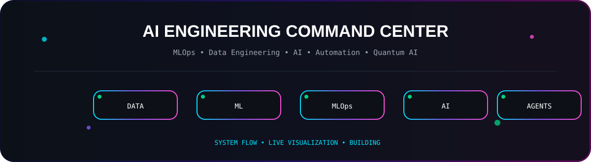
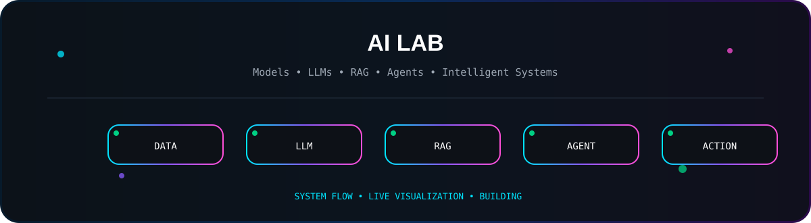
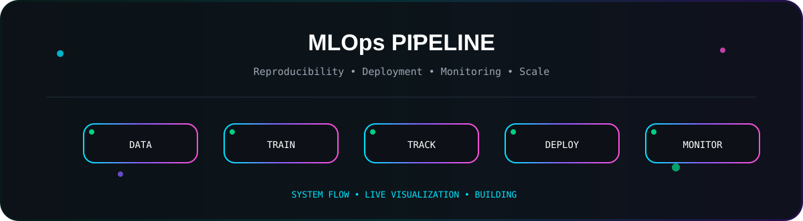
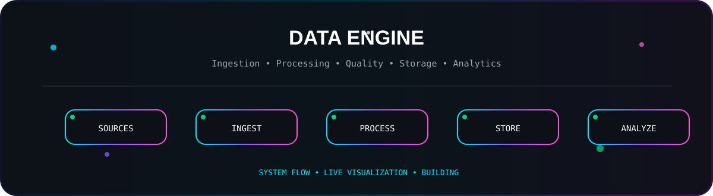
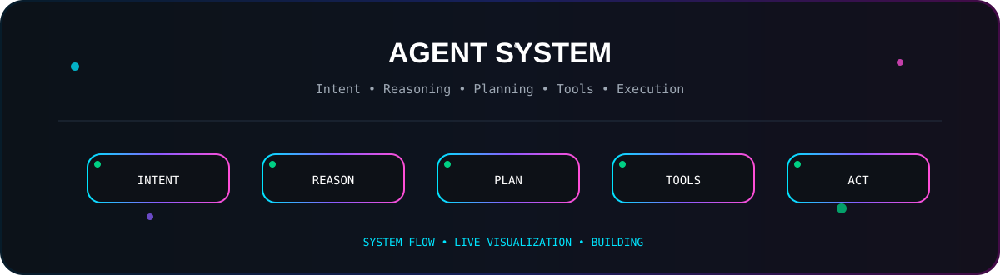
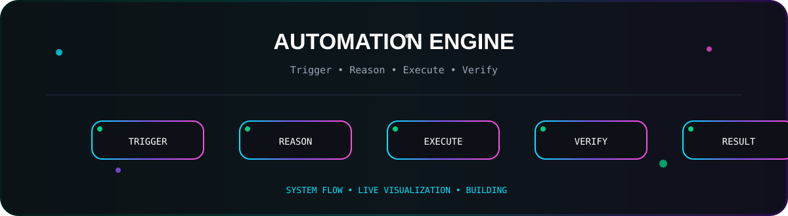
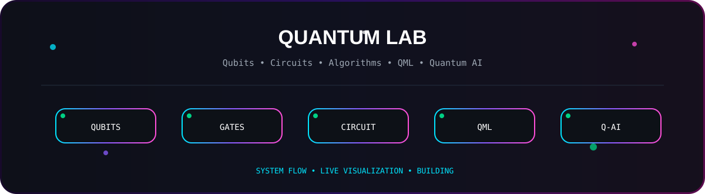
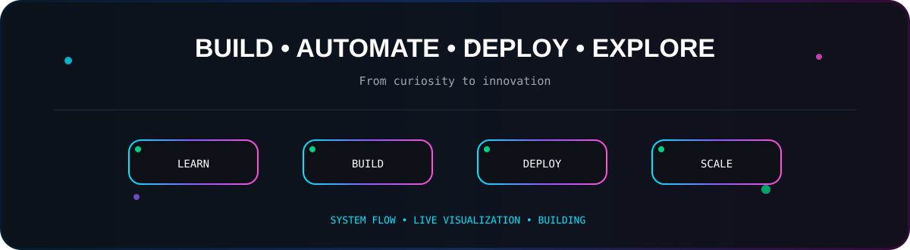

<div align="center">



<h1>⚡ DINESH TIMILSENA</h1>


<br/>


<br/>


</div>

---

## 🧬 `DINESH // AI ENGINEERING NODE`

> **Data → Intelligence → Infrastructure → Automation → Impact**

I'm a **BSc CSIT student** building toward **MLOps, Data Engineering, Artificial Intelligence, and intelligent automation**, with a strong curiosity for **Quantum Computing and Quantum AI**.

I care about what happens **after the notebook**: reproducible data, reliable pipelines, deployable models, observability, intelligent agents, and automated systems.

```text
DATA ──► ML ──► MLOps ──► GenAI ──► AGENTS ──► AUTOMATION
  │                                      │
  └────────────── INFRASTRUCTURE ────────┘
                         │
                         ▼
                  REAL-WORLD SYSTEMS
```

---

## 🧠 AI LAB



**Exploring:** `Machine Learning` · `Deep Learning` · `GenAI` · `LLMs` · `RAG` · `AI Agents` · `Embeddings` · `Vector Search` · `Tool Calling`

---

## ⚙️ MLOps LAB



```text
DATA → VALIDATE → TRAIN → TRACK → REGISTER → CONTAINERIZE
                                             ↓
                         DEPLOY → MONITOR → FEEDBACK → RETRAIN
```

**Focus:** `MLflow` · `DVC` · `Docker` · `Kubernetes` · `CI/CD` · `Model Serving` · `Monitoring`

---

## 📊 DATA ENGINEERING LAB



**Focus:** `Python` · `SQL` · `ETL/ELT` · `Airflow` · `Spark` · `Kafka` · `PostgreSQL` · `Data Warehousing`

---

## 🤖 AGENTIC AI LAB



```text
USER → INTENT → REASON → PLAN → TOOL/API → EXECUTE → VERIFY → RESULT
```

**Exploring:** `LLMs` · `RAG` · `Agents` · `Memory` · `Planning` · `Function Calling` · `Multi-Agent Systems`

---

## ⚡ AUTOMATION LAB



**Direction:** scripts → workflows → AI automation → agentic workflows → autonomous systems.

---

## ⚛️ QUANTUM LAB

<div align="center">



</div>

### `QUANTUM COMPUTING × AI`

```text
QUBITS → GATES → CIRCUITS → ALGORITHMS → QML → QUANTUM AI
```

**Exploring:** `Qubits` · `Superposition` · `Entanglement` · `Quantum Circuits` · `Quantum Algorithms` · `Qiskit` · `Quantum Machine Learning`

---

## 🧰 TECHNOLOGY MATRIX

<div align="center">


</div>

---

## 🐍 CONTRIBUTION MATRIX

<p align="center">
  <picture>
    <source media="(prefers-color-scheme: dark)" srcset="https://raw.githubusercontent.com/dineshtimilsena0/dineshtimilsena0/output/github-snake-dark.svg"/>
    <source media="(prefers-color-scheme: light)" srcset="https://raw.githubusercontent.com/dineshtimilsena0/dineshtimilsena0/output/github-snake.svg"/>
    
  </picture>
</p>

---

## 🛰️ BUILD QUEUE

| Mission | Domain | Status |
|---|---|---|
| 🤖 AI Agent Infrastructure | AI / Agents | 🟡 Building |
| ⚙️ Production MLOps Pipeline | MLOps | 🟡 Building |
| 📊 Scalable Data Pipeline | Data Engineering | 🟡 Building |
| ⚡ AI Automation Engine | Automation | 🟡 Exploring |
| 🎙️ Voice AI System | AI | 🟡 Exploring |
| ⚛️ Quantum AI Experiments | Quantum | 🔵 Research |

> Repositories will be promoted here as they become public and production-ready.

---

## 🧭 ENGINEERING LOOP

```text
LEARN → EXPERIMENT → BUILD → BREAK → DEBUG → IMPROVE → DEPLOY → MONITOR → SCALE
```

> **Frameworks change. Engineering fundamentals compound.**

---

## 🌌 LONG-TERM VISION

```text
DATA
  ↓
MACHINE LEARNING
  ↓
MLOps
  ↓
PRODUCTION AI
  ↓
GENERATIVE AI
  ↓
AI AGENTS
  ↓
INTELLIGENT AUTOMATION
  ↓
AUTONOMOUS SYSTEMS
  ↓
QUANTUM + AI
```

### **Build intelligent systems that are reliable, scalable, observable, and increasingly autonomous.**

---

## 🌐 CONNECT

<p align="center">
<a href="https://github.com/dineshtimilsena0">

</a>
</p>

<p align="center">

</p>

<p align="center"><sub>© 2026 Dinesh Timilsena • From curiosity to innovation.</sub></p>
